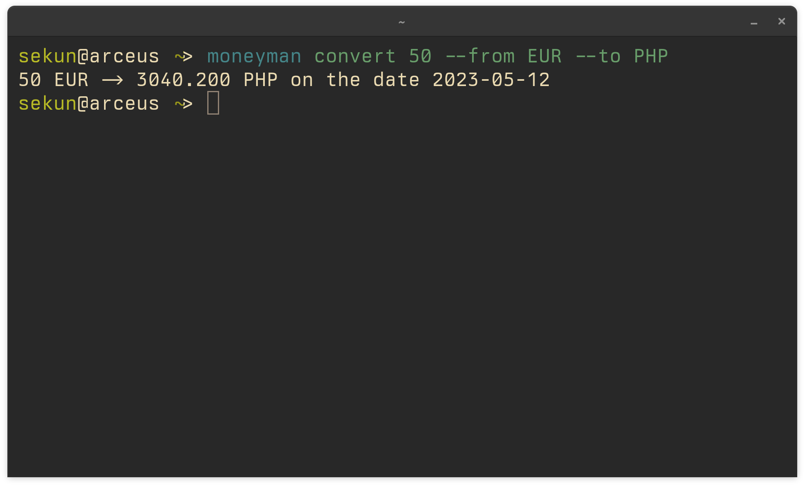

# 💱 moneyman


A crusty currency converter



## Example

```
$ moneyman convert 50 --from EUR --to PHP --on 2023-05-06 --fallback
50 EUR -> 3044.5833333333350 PHP on the date 2023-05-06
```

`moneyman` is also available as a library.

```rust
use std::path::PathBuf;

use chrono::NaiveDate;
use rust_decimal_macros::dec;
use rusty_money::{iso, Money};

fn main() {
    // Choose where to save the historical data files.
    let data_dir: PathBuf = dirs::home_dir()
        .and_then(|home_dir| Some(home_dir.join(".moneyman")))
        .expect("need a home directory");

    // Fetches the historical data from European Central Bank, and creates an
    // exchange store.
    let store = moneyman_core::ExchangeStore::sync(data_dir).expect("failed ze sync");

    let amount_in_usd = Money::from_decimal(dec!(6500), iso::USD);
    let date = NaiveDate::from_ymd_opt(2023, 5, 4).expect("ok date");

    // Converts 6,500.00 USD to EUR
    let actual = store.convert_on_date(amount_in_usd, iso::EUR, date);
    let expected = Money::from_decimal(dec!(5869.6044789597254831135994221), iso::EUR);

    // Shouldn't explode? :)
    assert_eq!(actual, expected);
}
```

## Details

`moneyman` extends on `rusty-money` as it already provides a lot of the things like
`Money`, `Currency`, `ExchangeRate`, and `Exchange`. However, it does not
provide any data to actually convert currency. For historical data, `moneyman`
uses the European Central Bank, and saves its data to its own local data store.

## Caveat

One important thing to know is that `ANY_OTHER_CURRENCY` -> EUR is computed with
`1/<RATE_OF_ONE_EUR_IN_THAT_OTHER_CURRENCY>` since ECB only contains the
EUR -> `ANY_OTHER_CURRENCY` rates, not vice versa. This [dividing] is most
probably not the behavior observed by RealWord™ currency exchanges. So this
only serves as an approximation at best.
